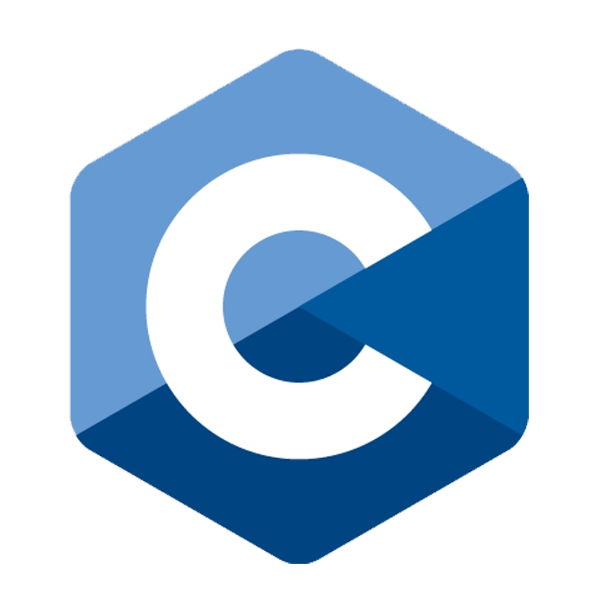
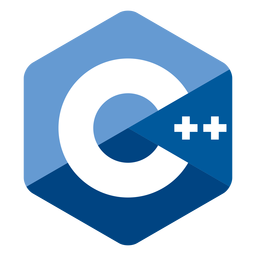
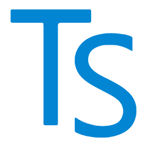
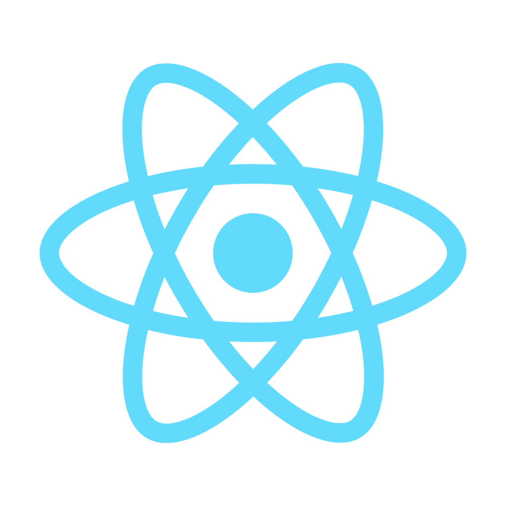
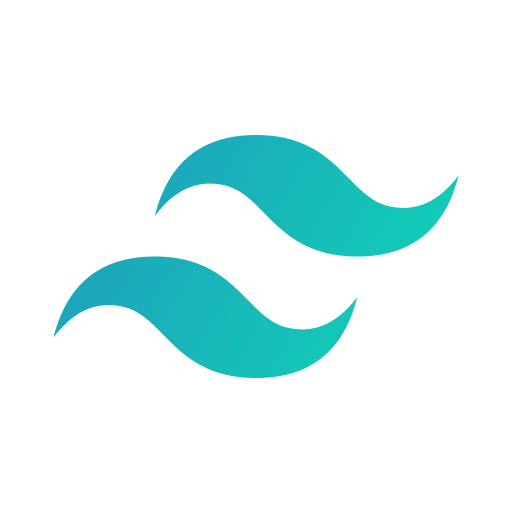
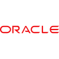
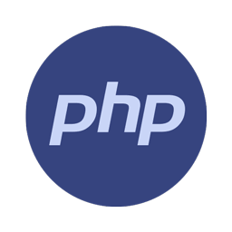

<h1>Rohit's Portfolio</h1>

Welcome to my portfolio! This repository showcases my projects and works, providing an overview of my skills and experience. Feel free to explore the projects, and if you have any questions or would like to collaborate, please don't hesitate to contact me.

<h3>Table of Contents</h3>

<h6>About Me</h6>

<h6>Education</h6>

<h6>Skills</h6>

<h6>Projects</h6>

<h6>Contact Me</h6>

<h3>About Me</h3>

<pre>I'm Rohit, I'm a Frontend Web Developer. I have completed my Bachelor's in Computer Application from Doon Group of
Institutions, Rishikesh. Currently, I am pursuing my Masters in Computer Applications from Graphic Era Hill University
, Dehradun. I am very passionate about improving my coding skills & developing websites. I build WebApps and Websites
using MERN Stack. Working for myself to improve my skills.</pre>

<h3>Education</h3>
<pre>Masters in Computer Application
Graphic Era Hill University, Dehradun
2022-2024 | Pursuing</pre>

<pre>Bachelors in Computer Application
Doon Group of Institutions, Rishikesh
2019-2022 | Completed</pre>

<h3>Skills</h3>
<pre>C
C++
HTML5
CSS3
JavaScript
TypeScript
ReactJs
TailwindCss
MaterialUI
Bootstrap
GitHub
Oracle
MySQL
PHP
Canva
Python</pre>

<h3>Projects</h3>

<h6>Project 1: Paryatak</h6>
<pre>Description: Paryatak is a travel website which provides information about the places to visit in Uttarakhand. It also
provides information about the hotels and restaurants in Uttarakhand.
</pre>
link: https://paryatak.vercel.app

<h6>Project 2: Portfolio</h6>
<pre>Description: Portfolio is a personal website which provides information about the person. It also provides information
about the skills and projects of the person.
</pre>
link: https://rohitbedwal9.github.io/portfolio

<h6>Project 3: Todo List App</h6>
<pre>Description: Todo App is a web application used to manage tasks. It also provides information about the
tasks which are completed and which are not completed.
</pre>
link: https://todos-list-woad.vercel.app

<h3>Contact</h3>
<pre>I am always open to new opportunities and collaborations. You can reach out to me through the following channels:

Email: rohitbedwal9@gmail.com
LinkedIn: https://www.linkedin.com/in/rohitbedwal9
GitHub: https://github.com/rohitbedwal9
Feel free to reach out to me if you have any questions or job opportunities, or if you'd like to work together on a 
project.
</pre>
Thank you for visiting my portfolio!

